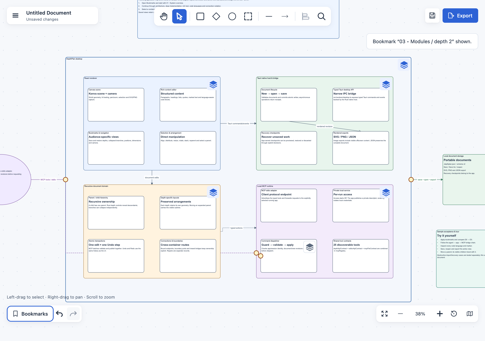

# DepthPlan

DepthPlan is a desktop diagram editor from TwistedPears. Keep a system overview,
nested components, connections, rich text and code in one document, then use
bookmarks and depth controls to present different levels of detail.

**The application is in development and has not been released.** Platform support,
installed-candidate acceptance, signing and security/support decisions remain
[release requirements](docs/release.md).

[Try it](docs/preview.md) · [Open the sample tour](docs/sample/depthplan_application_tour.depthplan) · [Give feedback](https://github.com/TwistedPears/depthplan-diagram/issues/new/choose)



The application tour at depth 2 in a macOS development build. Use bookmarks to
move between the system overview and deeper detail in the same document.

There is no downloadable preview yet. You can [build from source](#build-and-run)
or follow the [tester guide](docs/preview.md) for availability, a short exercise
and current limitations.

## Build and run

Use Node.js 24, npm 10+, Rust 1.94.1 and the
[Tauri native prerequisites](https://v2.tauri.app/start/prerequisites/).
From a checkout:

```sh
cargo install cargo-about --version 0.9.2 --locked --features cli
npm ci
npm run dev
```

`npm run build` creates ordinary release executables; `npm run package` creates
host-native installers without publishing. See [development](docs/development.md)
for toolchains, validation, dependency audits, licenses and capacity commands.
The app and bundled MCP adapter need no global Node installation when distributed.

Local artifacts are unsigned unless signing is configured. They are development
builds, not approved public releases. Updates currently require manual installation;
there is no automatic update check, download or install-on-quit behavior.

## Work with nested diagrams

Each root has its own reveal depth: D0 shows the root, D1 its children and D2 its
grandchildren. Local stack controls open or close individual branches. Ordinary
collapse remembers which descendants were open; Ctrl+click collapses them all.

Opening children auto-arranges overlapping content, grows parents and pushes
colliding neighbors aside with a short animation. Closing restores the relevant
arrangement. Manual edits are remembered per state and saved with the document;
unrelated objects keep their current geometry. Direct drag/resize remains manual.
Positions and sizes are also stored separately for each root depth, while text,
styles and ownership are shared. Moving a parent carries its children.

Scroll to zoom around the pointer. Right-drag, or use the Hand tool, to pan.
Search includes hidden objects; choosing a result reveals its path. Copy/paste
with Ctrl/Cmd+C and Ctrl/Cmd+V duplicates selected diagram content down/right;
text editors retain normal text clipboard behavior.

Bookmarks capture depths, folds, positions/sizes and camera focus. Applying one
is undoable and preserves current object content/style/ownership. Reset View
replaces its saved view; ordinary pan/zoom does not change it or dirty the document.

Save preserves the complete current-format document and inactive layouts. New,
Open, Reload and recovery Restore start new undo sessions; Save keeps history.
Unsaved-work guards and external-file conflict checks prevent silent replacement.
Recovery checkpoints accepted edits separately from source files; recent changes
and unfinished drafts can be lost, so keep separate backups.

Whole/selection exports include revealed offscreen content and appropriate
connections, with no editor controls or hidden descendants. Large PNG output uses
tiled streaming; practical limits still depend on memory/disk/time. The
[document and editing reference](docs/document-and-editing.md) defines format,
containment, connections, rich content, bookmarks, persistence and export details.

## Local automation

Enable **Menu → MCP Server**, then open **MCP Details** for the executable,
descriptor and client configuration. The 26 tools edit the same live document as
the UI. Access starts Off each launch; disk operations require explicit local
folder approval. See [MCP setup and tools](docs/mcp.md).

## AI architecture skills

Use the [installable skills](skills/README.md) to
[audit a codebase](skills/depthplan-audit/SKILL.md),
[build or refresh a navigable architecture map](skills/depthplan-map/SKILL.md), and
[find where a code change belongs](skills/depthplan-locate/SKILL.md).
They cover source evidence, database views and Rails conventions, with separate
audit review and read-only placement workflows. See the
[worked examples](skills/examples/README.md) for setup and usage.

## Documentation

| Guide                                                | Contents                                                    |
| ---------------------------------------------------- | ----------------------------------------------------------- |
| [Try DepthPlan](docs/preview.md)                     | Preview availability, first steps, limitations and feedback |
| [Contributing](CONTRIBUTING.md)                      | Reporting problems and making small code changes            |
| [Product requirements](docs/PRD.md)                  | Audience, workflows, feature scope and non-goals            |
| [Architecture](docs/architecture.md)                 | Native/renderer ownership, rendering and trust boundaries   |
| [Document and editing](docs/document-and-editing.md) | Current file format and precise editor behavior             |
| [MCP](docs/mcp.md)                                   | Client setup, tools, permissions and retries                |
| [Development](docs/development.md)                   | Build, test, audit, license and performance procedures      |
| [Release](docs/release.md)                           | Candidate acceptance, unresolved risks and owner decisions  |
| [Icons](docs/design/icons.md)                        | Artwork, prompt collections and integration                 |
| [Samples](docs/sample/README.md)                     | Editable examples and expected behavior                     |
| [Security status](SECURITY.md)                       | Current boundaries and pending reporting policy             |

## License

DepthPlan uses the Business Source License 1.1; see [LICENSE](LICENSE) and the
non-binding [commercial terms summary](COMMERCIAL-TERMS.md). Personal, educational,
non-profit, and internal business use are free of charge. White-labeling,
commercial redistribution, hosted services, and embedding DepthPlan in a commercial
product distributed to third parties require a separate commercial license.

This version converts to Apache License 2.0 on January 1, 2030, or the fourth
anniversary of its first public distribution under this license, whichever comes
first. Until that conversion, this is source-available software, not an open-source
license. Third-party components retain their own licenses; see
[THIRD-PARTY-NOTICES.md](THIRD-PARTY-NOTICES.md).
